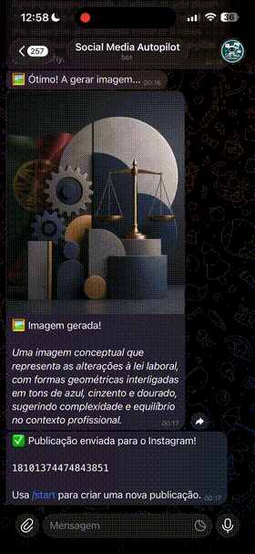
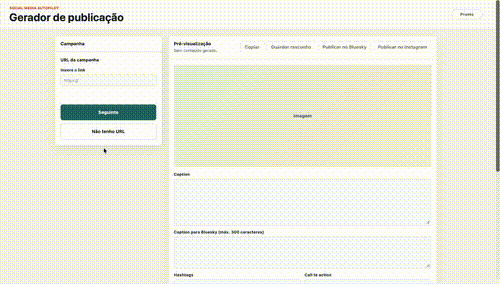

# 2026-ei-aoopii-c23

Agent: Social Media Autopilot

Alunos:

- Duarte Bravo Nª31385 duartebravo@ipvc.pt
- Tomás Felicíssimo Nº31375 tomasfelicissimo@ipvc.pt

## Estado do projeto

O projeto encontra-se finalizado na versao atual. O Social Media Autopilot ja
permite criar uma publicacao completa para Instagram, gerar a imagem de apoio e
publicar automaticamente no Instagram atraves da Instagram Platform API.

Tambem esta disponivel publicacao automatica no Bluesky como integracao
adicional e prova de funcionamento multi-rede.

## Objetivo

O Social Media Autopilot e um MVP academico de um agente de social media para
ajudar pequenos negocios a criar publicacoes para redes sociais a partir de um
URL ou de um formulario manual.

O sistema recolhe informacao sobre a marca/campanha, gera texto com IA, cria um
prompt visual, gera uma imagem sem texto e permite guardar ou publicar a
publicacao diretamente nas plataformas configuradas.

## Funcionalidades entregues

- preenchimento automatico do formulario a partir do URL de um negocio/campanha
  com Gemini;
- preenchimento manual dos dados da campanha;
- revisao e edicao dos campos antes da geracao;
- geracao de caption para Instagram com Gemini;
- geracao de caption curta para Bluesky, limitada a 300 caracteres;
- geracao de hashtags, call to action, tom usado, alt text e prompt visual;
- geracao de imagem com OpenAI, sem texto inserido na imagem;
- pre-visualizacao e edicao do conteudo gerado na interface web;
- copia do texto final da publicacao;
- gravacao de rascunhos locais em `outputs/drafts/`;
- publicacao automatica no Bluesky com texto e imagem;
- publicacao automatica no Instagram com texto e imagem;
- conversao da imagem para JPEG antes da publicacao no Instagram;
- envio da imagem para Supabase Storage para obter um URL publico acessivel
  pela Meta;
- bot Telegram com fluxo completo desde o inicio da campanha ate guardar ou
  publicar.

## Interfaces disponiveis

O projeto pode ser usado de tres formas:

- terminal, para testar o fluxo base de geracao de texto e imagem;
- pagina web local, para usar o fluxo completo no browser;
- bot Telegram, para conversar com o agente atraves de `/start`.

## Input

Input inicial:

- URL do negocio/campanha; ou
- preenchimento manual.

Formulario da campanha:

- nome da marca;
- tema do post;
- voz da marca;
- publico-alvo;
- objetivo do post;
- notas adicionais.

## Output

O sistema pode produzir:

- caption para Instagram;
- caption curta para Bluesky;
- hashtags;
- call to action;
- tom usado;
- prompt visual para gerar imagem;
- alt text da imagem;
- imagem gerada localmente;
- imagem JPEG preparada para Instagram em `outputs/instagram/`;
- rascunho guardado em `outputs/drafts/`;
- publicacao automatica de texto e imagem no Bluesky;
- publicacao automatica de texto e imagem no Instagram.

## Estrutura atual

```text
.
├── .env.example
├── .gitignore
├── Pesquisa.md
├── README.md
├── pyproject.toml
├── backend/
│   ├── __init__.py
│   └── app/
│       ├── __init__.py
│       ├── config.py
│       ├── main.py
│       ├── web.py
│       ├── bot/
│       │   ├── __init__.py
│       │   ├── bot.py
│       │   ├── keyboards.py
│       │   ├── state.py
│       │   └── handlers/
│       │       ├── __init__.py
│       │       ├── confirm_flow.py
│       │       ├── form_flow.py
│       │       ├── generate_flow.py
│       │       ├── start.py
│       │       └── url_flow.py
│       ├── models/
│       │   ├── __init__.py
│       │   ├── brand.py
│       │   └── post.py
│       ├── services/
│       │   ├── __init__.py
│       │   ├── bluesky_publisher.py
│       │   ├── business_url_agent.py
│       │   ├── content_agent.py
│       │   ├── draft_store.py
│       │   ├── image_agent.py
│       │   ├── instagram_publisher.py
│       │   └── supabase_storage.py
│       ├── static/
│       │   ├── app.css
│       │   └── app.js
│       └── templates/
│           └── index.html
├── docs/
└── outputs/
    ├── drafts/
    └── instagram/
```

Nota: `outputs/`, `.env`, ambientes virtuais, cache Python e metadata
`*.egg-info/` sao ficheiros gerados localmente e estao ignorados pelo Git. A
pasta `docs/` existe na estrutura local, mas nao contem ficheiros nesta versao.

## Como usar

1. Criar um ficheiro `.env` com base em `.env.example`.

2. Preencher as variaveis necessarias:

```env
APP_ENV=development

GEMINI_API_KEY=...
GEMINI_TEXT_MODEL=gemini-2.5-flash

OPENAI_API_KEY=...
OPENAI_IMAGE_MODEL=gpt-image-2
OPENAI_IMAGE_QUALITY=medium
IMAGE_SIZE=1024x1280

IMAGE_OUTPUT_DIR=outputs

TELEGRAM_BOT_TOKEN=...

BLUESKY_HANDLE=exemplo.bsky.social
BLUESKY_APP_PASSWORD=...
BLUESKY_SERVICE_URL=https://bsky.social

INSTAGRAM_ACCOUNT_ID=...
INSTAGRAM_ACCESS_TOKEN=...
INSTAGRAM_API_VERSION=v22.0
INSTAGRAM_BASE_URL=https://graph.instagram.com

SUPABASE_URL=https://projeto.supabase.co
SUPABASE_SERVICE_ROLE_KEY=...
SUPABASE_BUCKET=instagram-posts
```

Notas:

- `TELEGRAM_BOT_TOKEN` so e necessario para correr o bot Telegram.
- `BLUESKY_HANDLE` e `BLUESKY_APP_PASSWORD` so sao necessarios para publicar
  no Bluesky.
- `INSTAGRAM_ACCOUNT_ID` e `INSTAGRAM_ACCESS_TOKEN` sao necessarios para
  publicar no Instagram.
- `SUPABASE_URL`, `SUPABASE_SERVICE_ROLE_KEY` e `SUPABASE_BUCKET` sao usados
  para enviar a imagem JPEG para um bucket publico antes de publicar no
  Instagram.

3. Instalar dependencias:

```bash
pip install -e .
```

### Usar no terminal

```bash
python -m backend.app.main
```

O terminal permite preencher manualmente os dados da campanha, gerar o texto e
gerar uma imagem local.

### Usar com pagina web local

```bash
python -m backend.app.web
```

Depois abrir:

```text
http://127.0.0.1:8000
```

Na pagina web, o utilizador pode inserir um URL, escolher "Nao tenho URL",
preencher ou editar o formulario, gerar texto, gerar imagem, copiar a caption,
guardar rascunho e publicar no Bluesky ou no Instagram.

### Usar com bot Telegram

```bash
python -m backend.app.bot.bot
```

No Telegram, iniciar conversa com:

```text
/start
```

O bot permite escolher entre enviar URL ou preencher manualmente. Depois mostra
um resumo editavel, gera o conteudo, pergunta se deve gerar imagem e apresenta
as acoes finais. Quando existe imagem, permite publicar diretamente no Bluesky
ou no Instagram. Tambem permite guardar o resultado como rascunho local ou
terminar sem guardar.

## Fluxo web final

```text
URL ou preenchimento manual
        ↓
BusinessUrlAgent
  preenche formulario editavel com Gemini
        ↓
ContentAgent
  gera texto, hashtags, CTA, alt text e prompt visual com Gemini
        ↓
ImageAgent
  gera imagem sem texto com OpenAI
        ↓
Escolher acao final
        ↓
DraftStore, BlueskyPublisher ou InstagramPublisher
  guarda rascunho, publica no Bluesky ou publica no Instagram
        ↓
SupabaseStorageUploader
  disponibiliza a imagem em URL publico para a Meta quando necessario
```

## Fluxo do bot Telegram

```text
/start
        ↓
Escolher URL ou preenchimento manual
        ↓
Confirmar ou editar formulario
        ↓
Gerar conteudo
        ↓
Escolher se gera imagem
        ↓
Escolher acao final
        ↓
Publicar no Bluesky, publicar no Instagram, guardar rascunho ou terminar
```

## Publicacao no Instagram

A publicacao no Instagram esta implementada e pronta a usar com as credenciais
configuradas no `.env`.

O fluxo usado pelo projeto e:

1. gerar o conteudo da publicacao;
2. gerar a imagem localmente;
3. converter a imagem para JPEG em `outputs/instagram/`;
4. enviar a imagem para Supabase Storage;
5. criar o container de media na Instagram Platform API;
6. publicar o container no Instagram.

A imagem precisa de estar acessivel por um URL publico, porque a Meta nao
consegue abrir imagens servidas apenas em `localhost`.

## Pesquisa

O documento de pesquisa sobre limitacoes, requisitos de autenticacao, permissoes
e restricoes de publicacao automatica noutras redes sociais esta disponivel em:

- [Pesquisa sobre redes sociais](Pesquisa.md)

## Notas finais

- A geracao de imagem usa creditos da OpenAI API.
- Para controlar custos, recomenda-se usar `OPENAI_IMAGE_QUALITY=medium`
  durante testes.
- O preenchimento por URL depende de o site estar publico e acessivel. Se o
  site bloquear leitura automatica, o utilizador pode preencher manualmente.
- O texto nao e inserido dentro da imagem gerada.
- O Bluesky usa uma caption especifica com ate 300 caracteres e a imagem e
  comprimida automaticamente quando necessario.
- O Instagram usa a caption principal, call to action e hashtags, respeitando o
  limite de 2200 caracteres.


## Demonstração

### Fluxo Mobile / Telegram



[Ver vídeo completo](Videos/fluxo-mobile.mp4)

### Fluxo Web



[Ver vídeo completo](Videos/fluxo-web.mp4)